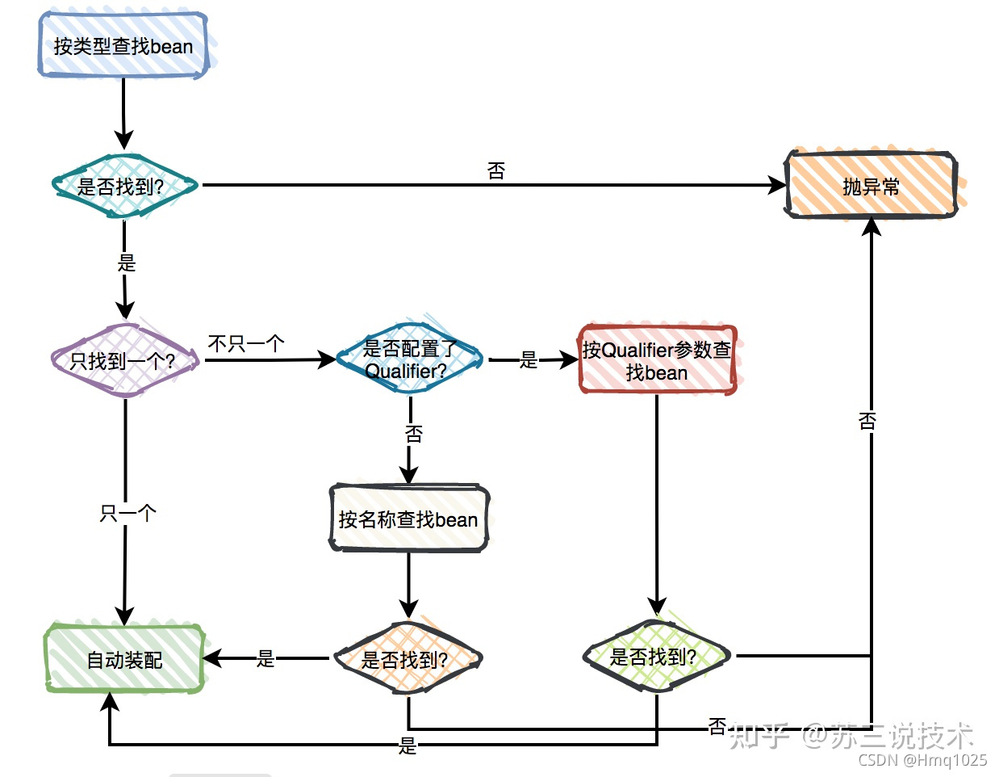
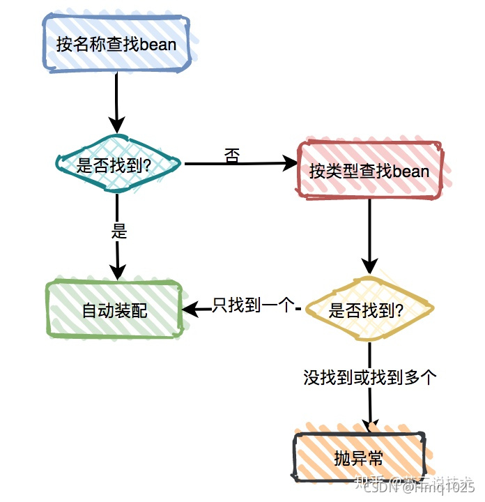

文章目录
- [SpringBoot的语义化注解](#springboot的语义化注解)
  - [@Controller](#controller)
  - [@Service](#service)
  - [@Repository](#repository)
  - [@Component](#component)
- [SpringBoot的控制器](#springboot的控制器)
  - [注册控制器](#注册控制器)
  - [控制器处理方法返回JSON](#控制器处理方法返回json)
  - [控制器接收请求](#控制器接收请求)
  - [获取请求中的参数](#获取请求中的参数)
    - [正常获取请求中的参数](#正常获取请求中的参数)
    - [获取请求路径中的占位符的值](#获取请求路径中的占位符的值)
  - [添加处理方法的参数规则](#添加处理方法的参数规则)
    - [@RequestBody](#requestbody)
    - [@RequestParam](#requestparam)
- [SpringBoot的自动注入](#springboot的自动注入)
  - [@Autowired注解](#autowired注解)
    - [@Autowired的byType注入](#autowired的bytype注入)
    - [@Autowired的byName注入](#autowired的byname注入)
  - [@Resource注解](#resource注解)
    - [@Resource的byType注入](#resource的bytype注入)
    - [@Resource的byName注入](#resource的byname注入)
  - [构造函数注入](#构造函数注入)
- [SpringBoot配置文件](#springboot配置文件)
  - [SpringBoot的核心配置文件](#springboot的核心配置文件)
  - [SpringBoot自定义配置](#springboot自定义配置)
    - [@Value](#value)
    - [@ConfigurationProperties](#configurationproperties)
- [SpringBoot拦截器](#springboot拦截器)
  - [创建拦截器](#创建拦截器)
  - [定义拦截配置](#定义拦截配置)
# SpringBoot的语义化注解
SpringBoot有应用于类上的语义化注解，这类注解的作用一样，有多种是为了增强可读性，本质都是把此类加载到Spring容器当中。

它们都可以接收一个可选参数，作为容器里面的唯一标识符，若不输入则默认为类名(第一个字母小写)，例如：``@Controller("testName")``。
## @Controller
@Controller注解用于标注控制层组件。
## @Service
@Service用于标注业务层组件。
## @Repository
@Repository用于标注数据访问组件，即DAO组件。
## @Component
@Component泛指组件，当组件不好归类的时候，我们可以使用这个注解进行标注。
# SpringBoot的控制器
## 注册控制器
使用@Controller注解放在控制类上方，让SpringBoot明白其是控制类。
```
@Controller
public class HelloController {

    @RequestMapping(value="/hello", method= RequestMethod.GET)
    public String sayHello(){
        return "hello";
    }
}
```
## 控制器处理方法返回JSON
如果想要控制器方法返回的是JSON，可以使用@ResponseBody注解或者@RestController注解：
* @ResponseBody：可以放在控制类的方法上面，表示该方法返回JSON；也可以放在控制类上，表示该控制类所有方法默认都是返回JSON。
* @RestController：可以当作@ResponseBody和@Controller的结合，其放在类上，表示该类是控制类，且类的所有方法默认返回JSON。

注意：@ResponseBody注解是把方法返回的数据通过转换器转为对应的格式，再写入response对象的body区，其通常用来返回JSON或者XML。
```
// 控制类的某个方法返回JSON
@Controller
public class HelloController {

    @ResponseBody
    @RequestMapping(value="/hello", method= RequestMethod.GET)
    public String sayHello(){
        return "hello";
    }
}
// 控制类的所有方法默认返回JSON
@Controller
@ResponseBody
public class HelloController {
    
    @RequestMapping(value="/hello", method= RequestMethod.GET)
    public String sayHello(){
        return "hello";
    }
}

@RestController
public class HelloController {
    
    @RequestMapping(value="/hello", method= RequestMethod.GET)
    public String sayHello(){
        return "hello";
    }
}
```
## 控制器接收请求
控制器就是用来接收请求并返回数据的，所以控制器的方法必须监听请求的路径，其一般使用@RequestMapping注解。

@RequestMapping(value="请求路径", method="请求方法")：@RequestMapping注解接收请求路径参数和请求方法可选参数。其可以放在控制器的类上，这注解会应用到控制类下所有处理方法；也可以只放在控制器的方法上，若类上有该注解而方法上也有，方法的该注解为类上的该注解的补充和覆盖。

@RequestMapping的method属性可以使用RequestMethod类，其静态属性表示接收哪种请求，如下：
  * RequestMethod.GET
  * RequestMethod.HEAD
  * RequestMethod.POST
  * RequestMethod.PUT
  * RequestMethod.PATCH
  * RequestMethod.DELETE
  * RequestMethod.OPTIONS
  * RequestMethod.TRACE

注意：@RequestMapping注解默认返回的是路径，所以要返回JSON数据必须使用@ResponseBody或有其作用的注解。
```
@RestController
@RequestMapping("/api")
public class HelloController {

    @RequestMapping(value="/hello", method= RequestMethod.POST)
    public String sayHello(){
        return "hello";
    }
}
```
若要更直观的知道该处理方法是接收什么方法，有新注解可代替@RequestMapping，如下：
* @GetMapping
* @PostMapping
* @PutMapping
* @DeleteMapping
* @PatchMapping

注意：这些注解同@RequestMapping，默认都是返回路径。
```
@RestController
public class HelloController {

    @PostMapping(value="/hello")
    public String sayHello(){
        return "hello";
    }
}
```
## 获取请求中的参数
### 正常获取请求中的参数
直接在处理方法中写好要传入的值的类型和别名即可，在前端传入的参数别名必须和处理方法设置的一样。
```
@RequestMapping(value = "/village/new", method = RequestMethod.POST)
public Object newVillage(@RequestBody String[] villages) {
    int cnt = villageService.newVillage(villages);
    if (cnt > 0) {
        return R.successBack();
    }
    return R.errorBack("新增失败");
}
```
### 获取请求路径中的占位符的值
请求路径中的占位符是指在请求路径的设置时设置的可动态变化的值。
```
@RequestMapping(value="user/{id}/{name}")
```
要获取上面动态变化的id和name属性，使用@PathVariable("xxx")注解，该注解用于处理方法的属性当中。

注意：id和name必须和@PathVariable()注解里面的值一样，如@PathVariable("id")和@PathVariable("name")。
```
@RequestMapping("show/{id}/{name}")
public Object test(@PathVariable("id") Long id, @PathVariable("name") String name)
```
## 添加处理方法的参数规则
### @RequestBody
@RequestBody注解用于处理方法接收的参数中，且只能指定一个参数，表示必须传该参数。
```
@RequestMapping(value = "/village/new", method = RequestMethod.POST)
public Object newVillage(@RequestBody String[] villages) {
    int cnt = villageService.newVillage(villages);
    if (cnt > 0) {
        return R.successBack();
    }
    return R.errorBack("新增失败");
}
```
### @RequestParam
@RequestParam注解同样用于处理方法接收的参数中，不过其可以应用多个，且有自己的属性可写。

语法：``@RequestParam(value="参数名", required="true / false",defaultValue="默认值")``
* value：参数名，和处理方法的参数名必须一致。
* required：可选值，是否包含该参数，默认为true，表示必须包含该参数。
* defaultValue：可选值，设置了改值，required=true就会失效，如没传参数，就是用默认值。
```
public Object test(@RequestParam(value="name", required=true, defaultValue="hello") String name)
```

# SpringBoot的自动注入
## @Autowired注解
@Autowired注解是Spring提供，只按照byType进行注入。@Autowired如果想要按照byName方式需要加@Qualifier，它可以对类成员变量、方法及构造函数进行标注，完成自动装配的工作。



### @Autowired的byType注入
```
// TestRepositoryJdbcImpl类
@Repository
public class TestRepositoryJdbcImpl implements TestRepositoryInterface {

    @Override
    public String save() {
        return "TestRepositoryJdbcImpl save methods!";
    }
}

// TestController类
@RestController
@ResponseBody
public class TestController {

    @Autowired
    private TestRepositoryInterface testRepositoryJdbcImpl;

    @GetMapping("/test/getTestRepository")
    public String getTestRepository() {
        return testRepositoryJdbcImpl.save();
    }
}
```
### @Autowired的byName注入
```
// TestRepositoryJdbcImpl类
@Repository("test")
public class TestRepositoryJdbcImpl implements TestRepositoryInterface {

    @Override
    public String save() {
        return "TestRepositoryJdbcImpl save methods!";
    }
}

// TestController类
@RestController
@ResponseBody
public class TestController {

    @Autowired
    @Qualifier("test")
    private TestRepositoryInterface testRepositoryUserImpl;

    @GetMapping("/test/getTestRepository")
    public String getTestRepository() {
        return testRepositoryUserImpl.save();
    }
}
```
## @Resource注解
@Resource注解是Java标准库提供。默认采用byName方式进行注入，如果找不到则使用byType。可通过注解参数进行改变。比起Autowired好处在于跟Spring的耦合度没有那么高。



### @Resource的byType注入
```
// TestRepositoryJdbcImpl类
@Repository
public class TestRepositoryUserImpl implements TestRepositoryInterface {

    @Override
    public String save() {
        return "TestRepositoryUserImpl save methods!";
    }
}


// TestController类
@RestController
@ResponseBody
public class TestController {

    @Resource
    private TestRepositoryInterface testRepositoryUserImpl;

    @GetMapping("/test/getTestRepository")
    public String getTestRepository() {
        return testRepositoryUserImpl.save();
    }
}
```
### @Resource的byName注入
```
// TestRepositoryJdbcImpl类
@Repository("test")
public class TestRepositoryJdbcImpl implements TestRepositoryInterface {

    @Override
    public String save() {
        return "TestRepositoryJdbcImpl save methods!";
    }
}

// TestController类
@RestController
@ResponseBody
public class TestController {

    @Resource(name = "test")
    private TestRepositoryInterface test;

    @GetMapping("/test/getTestRepository")
    public String getTestRepository() {
        return test.save();
    }
}
```
## 构造函数注入
Spring推荐的注入方式，因为@Autowired和@Resource通过反射将对象直接注入私有属性，会破环封装性。
```
// TestRepositoryJdbcImpl类
@Repository
public class TestRepositoryJdbcImpl implements TestRepositoryInterface {

    @Override
    public String save() {
        return "TestRepositoryJdbcImpl save methods!";
    }
}

// TestController类
@RestController
@ResponseBody
public class TestController {

    private TestRepositoryInterface testRepositoryJdbcImpl;

    public TestController(TestRepositoryInterface testRepositoryJdbcImpl) {
        this.testRepositoryJdbcImpl = testRepositoryJdbcImpl;
    }

    @GetMapping("/test/getTestRepository")
    public String getTestRepository() {
        return testRepositoryJdbcImpl.save();
    }
}
```

# SpringBoot配置文件
## SpringBoot的核心配置文件
SpringBoot核心配置文件为resources文件夹内的application.properties文件

application.properties值的格式为： ``object.item.key=value`` 

SpringBoot核心配置文件后缀除了为properties，还能为yml或yaml

application.yml和application.yaml值的格式为 ：
```
object:
    item:
        key: value
``` 

要注意SpringBoot核心配置文件后缀有三种，但是名称必须为application，且只能有一个

SpringBoot核心配置文件可以根据环境匹配相应的核心配置文件

根据环境匹配的核心配置文件必须按规定的格式命名 ``application-{自定义}.{properties|yml|yaml}``

然后在application.properties中引入 ``server.servlet.context-path=/自定义``
## SpringBoot自定义配置
SpringBoot中除了使用内置配置项外，还可以去自定义配置，然后在类中获取配置的属性值。
### @Value
@Value注解用于获取自定义配置的属性值，其用于类中的属性。

语法：``@Value("${属性名}")``

```
// application.yml文件
test:
  name: lty
webkit: www.baidu.com

// TestController类
@RestController
@ResponseBody
public class TestController {

    @Value("${test.name}")
    private String testName;

    @Value("${webkit}")
    private String webkit;

    @GetMapping("/test/getvalue")
    public String getValue() {
        return this.testName + ' ' + this.webkit;
    }
}
```
### @ConfigurationProperties
@ConfigurationProperties注解也是用于获取自定义配置的属性值，不过其是用于类上，相当于一次使用了多个@Value注解。

语法：``@ConfigurationProperties(prefix = "前缀名")``

```
// application.yml文件
login:
  name: ltyppx
  password: 123456
  max-length: 1000

// LoginComponent类
@Component
@ConfigurationProperties(prefix = "login")
public class LoginComponent {

    private String name;

    private String password;

    private String maxLength;

    public String getName() {
        return name;
    }

    public void setName(String name) {
        this.name = name;
    }

    public String getPassword() {
        return password;
    }

    public void setPassword(String password) {
        this.password = password;
    }

    public String getMaxLength() {
        return maxLength;
    }

    public void setMaxLength(String maxLength) {
        this.maxLength = maxLength;
    }
}

// TestController类
@RestController
@ResponseBody
public class TestController {

    @Autowired
    private LoginComponent loginComponent;

    @GetMapping("/test/getLoginInfo")
    public Map<String, Object> getLoginInfo() {
        Map<String, Object> map = new HashMap<>();
        map.put("name", loginComponent.getName());
        map.put("password", loginComponent.getPassword());
        map.put("maxLength", loginComponent.getMaxLength());
        return map;
    }
}
```
# SpringBoot拦截器
## 创建拦截器
```
package com.springboot.test.interceptor;

import com.springboot.test.model.User;
import org.springframework.web.servlet.HandlerInterceptor;
import org.springframework.web.servlet.ModelAndView;

import javax.servlet.http.HttpServletRequest;
import javax.servlet.http.HttpServletResponse;

public class UserInterceptor implements HandlerInterceptor {

    @Override
    public boolean preHandle(HttpServletRequest request, HttpServletResponse response, Object handler) throws Exception {
        User user = (User) request.getSession().getAttribute("user");
        if(user == null) {
            response.sendRedirect(request.getContextPath() + "/user/nologin");
            return false;
        }
        return true;
    }

    @Override
    public void postHandle(HttpServletRequest request, HttpServletResponse response, Object handler, ModelAndView modelAndView) throws Exception {

    }

    @Override
    public void afterCompletion(HttpServletRequest request, HttpServletResponse response, Object handler, Exception ex) throws Exception {

    }

}

```
## 定义拦截配置
```
package com.springboot.test.config;

import com.springboot.test.interceptor.UserInterceptor;
import org.springframework.context.annotation.Configuration;
import org.springframework.web.servlet.config.annotation.InterceptorRegistry;
import org.springframework.web.servlet.config.annotation.WebMvcConfigurer;

@Configuration
public class InterceptorConfig implements WebMvcConfigurer {
    @Override
    public void addInterceptors(InterceptorRegistry registry) {
        String[] addPathPatterns = {
            "/user/*",
        };

        String[] excludePathPatterns = {
                "/user/login",
                "/user/nologin",
        };

        registry.addInterceptor(new UserInterceptor()).addPathPatterns(addPathPatterns).excludePathPatterns(excludePathPatterns);
    }
}

```